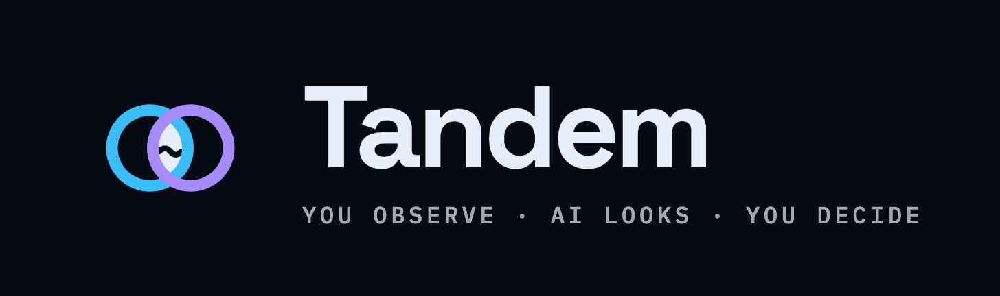
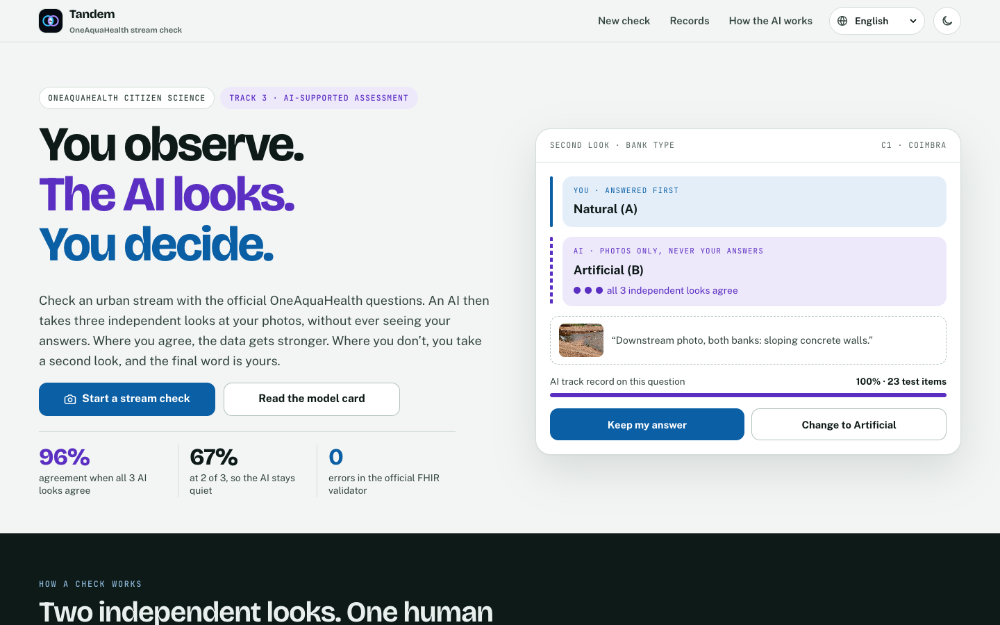
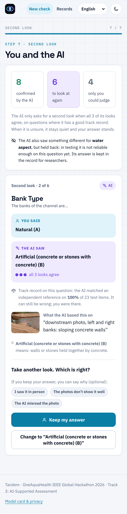
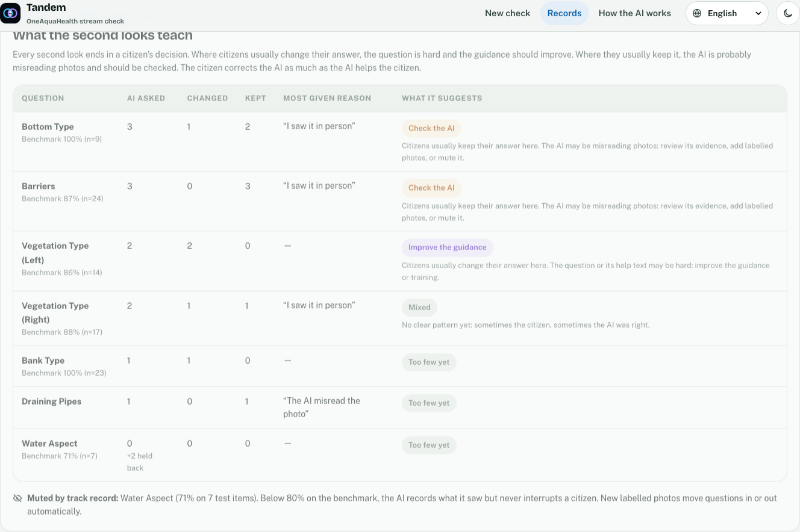

<p align="center"></p>

# Tandem

**Two independent looks at every stream check: the citizen answers first, the AI looks at the photos blind, and the citizen decides.**

OneAquaHealth IEEE Global Hackathon 2026 · **Track 3: AI-Supported Assessment**

- **Live demo:** _add the Vercel URL here_
- **Demo video:** _add the video URL here_



---

## Track alignment

Track 3 asks for AI that supports stream assessment **without replacing human judgment**, because citizen observations can be inconsistent and error-prone. It names four building blocks. Tandem delivers each one:

| Track 3 asks for | What Tandem does | Where in the code |
|---|---|---|
| **AI prompts** | An abstain-first vision prompt. It uses the official OneAquaHealth questions with a rule for each on when to say "cannot tell", knows that left and right flip between upstream and downstream photos, and returns a strict JSON schema with the evidence written before the answer. | [server/prompt.ts](server/prompt.ts) |
| **Validation checks** | 13 rule checks need no AI, e.g. "rated Good but reported sewage" (from the official rating definitions) or "dry channel but water described". **Site memory** flags a channel, bed or bank that differs from the last check at the same site, because those rarely change between visits. Blur and darkness are checked on the phone. The AI flags photos that show no stream. **Integrity checks** catch input made without looking: automated browsers (quarantined: kept, not counted, never learned from), answers faster than the questions can be read, the same photo sent twice, and a photo reused from an earlier check. | [src/core/rules.ts](src/core/rules.ts), [src/core/integrity.ts](src/core/integrity.ts), [src/app/photo.ts](src/app/photo.ts) |
| **Explainable AI** | Every AI answer names the photo and the spot it used. Confidence is shown as "3 of 3 looks agree", not a bare percentage, and that signal is **measured**: 96% agreement at 3 of 3 vs 67% at 2 of 3. Every second look also shows the AI's **measured track record on that question**. A model card states what the AI does, never does, and the exact prompt. | [src/core/ai.ts](src/core/ai.ts), [src/core/trust.ts](src/core/trust.ts), [src/app/pages/About.tsx](src/app/pages/About.tsx) |
| **Human-in-the-loop** | The citizen answers **before** seeing any AI output. The AI asks for a second look only when all three of its independent looks agree **and** it has earned trust on that question in the benchmark. Keep or change is one tap, and the overall Good / Moderate / Poor rating is always the citizen's. The loop runs both ways: the researcher view turns citizens' keep/change decisions into actions ("improve the guidance" or "check the AI"). | [src/core/reconcile.ts](src/core/reconcile.ts), [src/core/learning.ts](src/core/learning.ts), [src/app/flow/ReviewStep.tsx](src/app/flow/ReviewStep.tsx) |

## The problem

Citizen stream checks scale monitoring, but the answers vary: murky versus tea-coloured water, slow versus stagnant flow, left versus right bank, "Good" because it looks green. The obvious fix, letting an AI fill in the form, creates a new problem. When people see an automated answer first, they tend to accept it even when it is wrong (automation bias; Parasuraman & Manzey 2010, *Human Factors*; Goddard et al. 2012, *JAMIA*). The citizen stops observing and the data loses its independence.

## How Tandem works

```
1. You observe     Photos (upstream, downstream, context, biodiversity) and the official
                   OneAquaHealth questions, word for word, with plain-language help.
                   The AI starts in the background, but its answers stay sealed.

2. The AI looks    A vision model answers the questions a photo can show, from the photos
   blind           only, three independent times. It never receives your answers. It says
                   "cannot tell" when the photos don't show enough.

3. Compare         Agree → the answer is corroborated.
                   AI unsure (looks disagree) → it stays quiet; your answer stands.
                   All 3 looks agree on something different → a second look:
                   your answer, the AI's answer, its evidence, the photo and the AI's
                   measured track record on that question, side by side.
                   Unanimous, but on a question where the AI tested below 80% → it holds
                   back, and its answer is kept in the record for researchers.

4. You decide      Keep (with an optional reason) or change, one tap either way.
                   Rule checks (including site memory) and anything unusual the AI noticed (litter, oil, algae,
                   wildlife) come next. Only what you confirm goes in.

5. Results         Overall health (your rating) · Water · Pollution · Biodiversity · Habitat
                   · "You and the AI": who said what and who decided · One Health notes for
                   people, animals and the ecosystem · the full audit trail · JSON, CSV and FHIR export.
```



### Design choices, and why

- **Blind first.** The AI never sees the citizen's answers and the citizen never sees the AI's until they are done, so agreement between them is real evidence.
- **Agreement is the confidence.** A model's own "90% sure" is poorly calibrated. Three independent looks at a non-zero temperature, and how often they agree, is a signal we can measure and explain (self-consistency; Wang et al., ICLR 2023).
- **Quiet when unsure.** A second look costs a volunteer time and trust, so the AI only asks when all three looks agree.
- **Trust is earned per question.** Unanimous looks can still be unanimously wrong. The AI may only interrupt on questions where it matched the independent reference at least 80% of the time in the evaluation (at least 5 labelled items). Water colour is at 71%, so today the AI records what it sees there but never asks. The list is read from `eval/report.json`, so new labelled photos move questions in or out without code changes.
- **The loop runs both ways.** Every second look ends in a human decision. Across records, questions where citizens usually *change* their answer point to hard wording (improve the guidance); questions where they usually *keep* it point to the AI misreading photos (check the AI). The demo data shows barriers in the second group, matching the benchmark's 87%.
- **Integrity without punishing people.** Some input is made without looking at a stream at all. An automated browser (`navigator.webdriver`) is **quarantined**: the record is kept for transparency, but it is not counted and the learning panel ignores it, so bots cannot poison the loop. Answers under 1.5 s each (faster than the official questions can be read), the same photo sent twice, or a photo reused from an earlier check (64-bit perceptual hash, computed on the phone) are shown to the citizen and flagged for researchers, never deleted: a fast, experienced volunteer is still a volunteer.
- **Site memory.** The channel shape, bed and banks of a stretch rarely change between visits. A difference from the last check at the same site is flagged as a consistency check, with no AI involved, and a note explaining real change (works, floods) is welcome.
- **The AI never rates health.** The overall rating comes from the citizen. The results also show a transparent view built from the *verified* answers against the official OneAquaHealth definitions of Good / Moderate / Poor.
- **Questions only a person can answer** (water depth, invasive species) are never sent to the AI.



## Evaluation: is the AI right when it speaks?

The AI ran on 25 openly licensed stream photos (Wikimedia Commons, credits in [eval/manifest.json](eval/manifest.json)) with the exact app prompt and 3 looks each. Its answers were compared with labels made **without seeing them**, by an independent AI reference (a different model, Claude) on every photo. The app's blind labelling screen (`#/label`) is ready for human and expert labels. Full report: [eval/REPORT.md](eval/REPORT.md).

| Against the independent AI reference (25 photos) | Result |
|---|---|
| Agreement when **all 3 looks agree**, the only time Tandem interrupts a citizen | **96%** (95% CI 93–97%), on 93% of answers |
| Agreement when only **2 of 3** looks agree | **67%**, which is why the AI stays quiet then |
| Simulated citizen errors caught by a second look / correct answers questioned | **90%** / **4%** |
| Weak spots | water colour (71%); the AI answers when it should say "cannot tell" more often than the reference (held back 41% of the time) |

The jump from 67% to 96% is the evidence behind the design rule: **speak only when all independent looks agree.** Two AI systems can share mistakes, so these numbers likely overstate real-world accuracy; that is stated in the app's model card too.

## Interoperability: FHIR R4

Each record exports as a FHIR R4 Bundle shaped by the official OneAquaHealth Implementation Guide ([hl7-eu/oah](https://github.com/hl7-eu/oah)):

- `Location` with the `LocationOah` profile, keyed by the OneAquaHealth site code.
- One `Observation` per answer with the `ObservationIndicatorsOah` profile, coded with the OneAquaHealth indicator it informs (`morophology`, `hydrology`, `LandUse`, `riparianVegetation`, `foam`, `invasiveOrganisms`), plus a citizen-question code. Riparian vegetation types reuse the IG's own codes.
- How each answer was reached (agreed, kept or changed after a second look) goes in `Observation.note` and a `Provenance` resource: the citizen is the author, the AI an informant.

**Validated with the official HL7 FHIR validator against the OneAquaHealth IG (built from hl7-eu/oah at `b907cf0`), with online terminology checks: 0 errors, 0 warnings** on all example Bundles and on Tandem's three CodeSystems. See [fhir/README.md](fhir/README.md) and the full log.

See [src/core/fhir.ts](src/core/fhir.ts). The in-app "View the FHIR R4 Bundle" panel shows the output for any record.

## Real OneAquaHealth data

- The 21 questions, answer letters and photo roles come from the official Citizen Science App (apps.oneaquahealth.eu), with the app's own official wording in **6 languages: English, Português, Italiano, Français, Nederlands and Norsk**, covering every pilot city. Tandem's own interface text is English.
- The 106 research sites in Coimbra, Benevento, Toulouse, Ghent and Oslo come from the public OneAquaHealth API.
- The field protocol reference is Calapez, Feio et al., *OneAquaHealth Field Sampling Protocols for Urban Stream Ecosystems*, Zenodo [10.5281/zenodo.20344421](https://zenodo.org/records/20344421).

## Architecture

```
Browser (React + TypeScript, Vite)                 Serverless function (Vercel)
 ├─ photos resized, EXIF/GPS removed on device ──►  POST /api/analyze
 ├─ answers stay on the device                        ├─ 3 parallel Gemini calls, same photos
 ├─ src/core: reconcile, rules, health, FHIR          ├─ strict JSON schema, sanitised
 └─ records in local storage, export JSON/CSV/FHIR    └─ majority vote → findings + agreement
```

- **Model:** Google Gemini (`gemini-3.8-flash` by default, set with `GEMINI_MODEL`), free tier. The API key stays on the server.
- **Without AI:** if the key is missing or the quota is spent, every check still works with rule checks only, and says so.
- **Running cost:** $0 on the Gemini free tier and Vercel's free plan.

## Run it

```bash
npm install
cp .env.example .env        # paste a free key from https://aistudio.google.com/apikey
npm run dev                  # http://localhost:5173
npm test                     # unit tests: AI aggregation, reconciliation, earned trust, rules, site memory, integrity, lessons, metrics
npm run e2e                  # full walkthrough in Chrome with the real AI, screenshots in out/e2e
npm run e2e -- http://localhost:5173 sample   # same walkthrough on the stored sample run, no AI quota needed
npm run models               # list the Gemini models your key can use
npm run eval:run             # run the AI on the evaluation photos (eval:fetch downloads them)
npm run eval:report          # score it against the labels → eval/REPORT.md
```

## Path to production

Tandem is a working prototype built to drop into the OneAquaHealth app. What changes for a real deployment:

| Today (prototype) | In production |
|---|---|
| Gemini free tier, where Google may use submitted photos to improve its products | A paid tier or Vertex AI in an EU region, where customer data is not used for training, under a data processing agreement (GDPR) |
| Records stay in the browser; export as JSON, CSV or FHIR | Each record posted as the already validated FHIR R4 Bundle to the OneAquaHealth FHIR server, with volunteer accounts |
| Rate limit of 6 checks per minute per IP, held in each server instance | A shared rate limit (for example Redis) plus sign-in; the automation check backed by server-side signals |
| Benchmark of 25 open photos with an independent AI reference | An expert-labelled set from OneAquaHealth photos through the built-in `#/label` screen; the earned-trust list re-tunes itself from `eval/report.json` |
| Needs a connection for the AI step (the check itself works without it) | An offline queue: answer at the stream, send the photos to the AI when back in signal |

The parts that carry over unchanged: the core logic in `src/core` (plain TypeScript, unit-tested), the prompt, the FHIR mapping, and the review flow.

## Honest limits

- **The evaluation set is small** (25 open photos) and the full-set reference labels come from a different AI model, so the figures above are agreement with an independent reference, likely an overestimate. An expert-labelled set from OneAquaHealth volunteers, through the built-in blind labelling screen, is the next step. Per-question track records rest on as few as 6 to 9 items, so the earned-trust list will move as labels grow.
- The automation check reads the browser's own `navigator.webdriver` flag: it catches off-the-shelf automation, but a determined bot can hide it. Server-side signals (rate limits, account history) are the next step once records are uploaded.
- Site memory only knows checks stored on the same device (plus the labelled demo records); connected to the OneAquaHealth server it would use the site's full history.
- A photo shows less than a person on the bank sees. When the citizen and the AI disagree, the citizen may well be right, and the record says so.
- The health view is decision support from the official definitions, not a validated ecological index or a lab result.
- Demo records in the researcher view (11, one of them a quarantined bot run) are synthetic and labelled "Demo" everywhere.
- On Gemini's free tier Google may use submitted content to improve its products. The app tells users this and asks them not to photograph people.

## Privacy

Photos are resized and re-encoded on the device, which removes EXIF data including GPS. Only the photos go to the AI. Answers and records stay in the browser until the user exports them.

## Credits

- OneAquaHealth project (EU Horizon Europe) for the citizen form, the site list and the FHIR Implementation Guide (HL7 Europe).
- Sample photo: "Concrete Currents; The Tamed Stream" by Jemir Shamir, Wikimedia Commons, CC BY-SA 4.0.
- Built with AI coding assistance (Claude Code). The design, decisions and testing were reviewed by the team.

## License

MIT. See [LICENSE](LICENSE).
